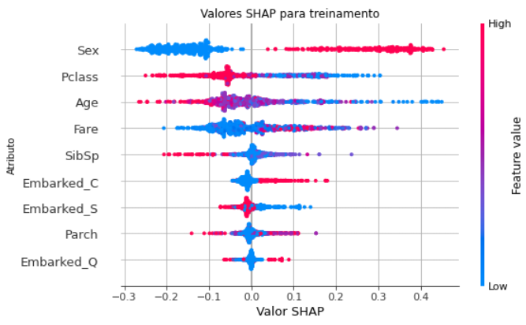
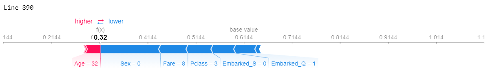
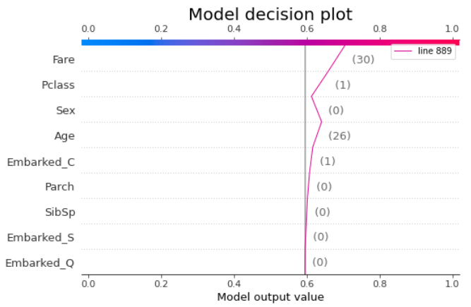

# Machine Learning Explainability with SHAP

## Tópicos

[Descrição](#Descrição)

[Dados](#Dados)

[SHAP Explainability](#SHAP-Explainability)

[Estrutura do Diretório](#Estrutura-do-Diretório)


### Descrição
A ideia aqui é brincar com o método SHAP para explicabilidade de modelos. Comentar algumas visualizações e como esse método pode ajudar no entendimento das features utilizadas no modelo. Para isso utilizei a base de um desafio já bem conhecido pela comunidade, o desafio do Titanic. Lógico, o desafio já é bem conhecido, já temos algumas hipóteses formadas (e que se comprovam), mas o intuito é ver como esse método pode ajudar em outros tipos de projetos. Por exemplo, conseguir explicar de uma forma mais visual porque um modelo de crédito negou crédito para o indivíduo "X". Ou porque a cliente "tal" foi classificado como fraude, quais as informações dele fez com que o modelo gerasse tal classificação. Enfim, a aplicabilidade vai de cada projeto e objetivo, mas com certeza pode ajudar no melhor entendimento do modelo.  

##### Algumas visus SHAP: 

Summary_Plot:


Force_plot:


Decision_plot:



### Dados
O dataset pode ser baixado no kaggle: https://www.kaggle.com/c/titanic/data


### SHAP Explainability
Curso sobre o assunto, também no kaggle: https://www.kaggle.com/learn/machine-learning-explainability


### Estrutura do Diretório

```
├───Model explainability with SHAP
│   │   README.md
│   │   SHAP_Titanic.ipynb
│   │   submission.csv
│   │   Resumo Análise.pdf
│   │
│   ├───imagens
│   │       Decision_plot.png
│   │       Force_plot.png
│   │       Summary_Plotpng
│   │
│   └───titanic data
│       │   gender_submission.csv
│       │   test.csv
│       │   train.csv
```

